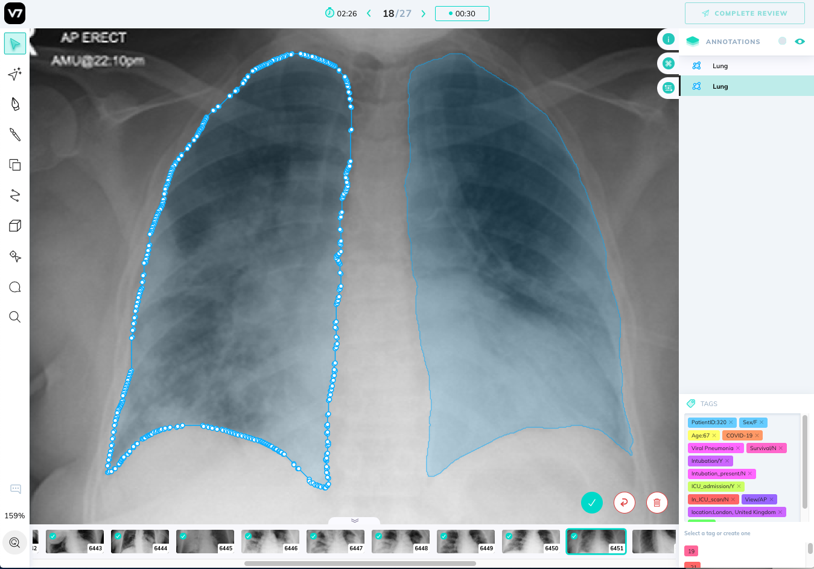
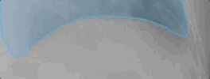
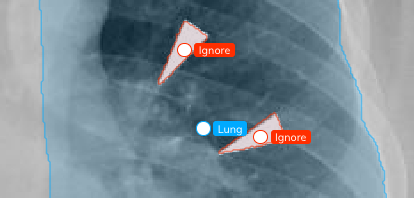
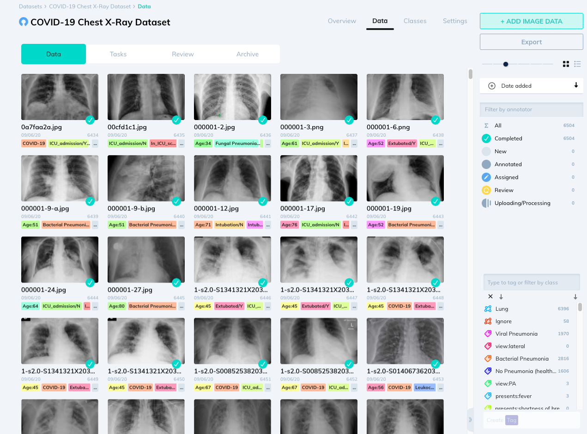
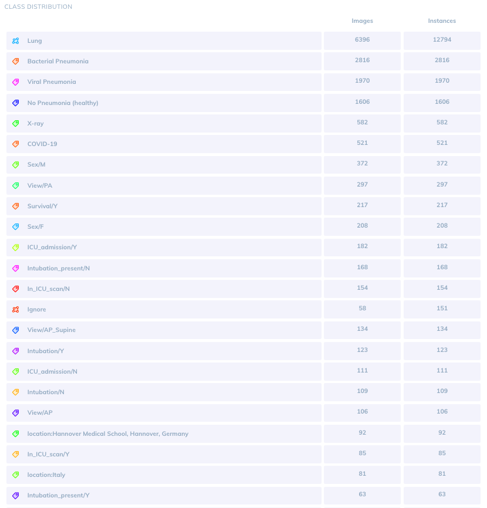

# COVID-19 xray dataset

[BROWSE & DOWNLOAD THE DATASET ON V7 DARWIN HERE](https://darwin.v7labs.com/v7-labs/covid-19-chest-x-ray-dataset)

or run the following command from [Darwin-py](https://v7labs.github.io/darwin-py/) to download the latest version

```bash
pip install darwin-py
darwin dataset pull v7-labs/covid-19-chest-x-ray-dataset:all-images
```

This dataset contains 6500 images of AP/PA chest x-rays with pixel-level polygonal lung segmentations. There are [517 cases](https://github.com/ieee8023/covid-chestxray-dataset) of COVID-19 amongst these.
Use the command below to download only images presenting COVID-19.

```sh
darwin dataset pull v7-labs/covid-19-chest-x-ray-dataset:covid-only
```

**WARNING:** This dataset is not intended for use in clinical diagnostics.

Each image contains:

- Two "Lung" segmentation masks (rendered as polygons, including the posterior region behind the heart).
- A tag for the type of pneumonia (viral, bacterial, fungal, healthy/none)
- If the patient has COVID-19, additional tags stating age, sex, temperature, location, intubation status, ICU admission, and patient outcome.

Lung annotations are polygons following pixel-level boundaries. These can be exported as `COCO`, `VOC`, or `Darwin JSON` formats. Each annotation file contains a URL to the original full resolution image, as well as a reduced size thumbnail.



**LUNG SEGMENTATION NOTES**: Lung segmentations in this dataset include most of the heart, revealing lung opacities behind the heart which may be relevant for assessing the severity of viral pneumonia. Uniformly shaped lungs also de-couples the shape and content within the left lung from the size of the heart.

The lower-most part of the lungs is defined by the extent of the diaphragm, where visible. If the back of the lungs is clearly visible through the diaphragm it is also included up until the lower-most visible part of the lungs.



Lung segmentations were performed by human annotators using [Auto-Annotate](https://www.v7labs.com/automated-annotation), adjusted, and reviewed by humans.

Other important notes:

- Image resolutions, sources, and orientations vary across the dataset, with the largest image being 5600x4700 and smallest being 156x156. You may sort images by dimensions on [Darwin](https://darwin.v7labs.com/v7-labs/covid-19-chest-x-ray-dataset) to exclude those below a threshold.
- Lateral x-rays do not contain lung segmentations. They have classification tags, but should be ignored if you are working with detection-based networks.
- There are 63 axial CT scan slices left un-labelled with masks (although they contain tags) as a way of maintaining integrity to one of the source datasets. We encourage discarding these when performing x-ray analysis.
- Portable x-ray images are of significant lower quality than others. Be aware that they correlate highly with severe conditions. Classification models will bias portable x-ray images with diseases like COVID-19.
- Medical instruments like pacemakers and markup that overlap the lungs are masked with an "Ignore" class. We encourage masking these out when performing lung analysis as they correlated strongly with sick patients. Intubation instruments are not removed if smaller/thinner than 1cm.




You may also use the `Ignore` class to filter out images with occluding markups or large medical instruments.

You can browse the available images and filter them by tag or annotation class using the right-sidebar as seen below. Follow this [Link](https://darwin.v7labs.com/v7-labs/covid-19-chest-x-ray-dataset) to access the interactive dataset.



Below are the 23 most commonly represented classes by image count and instances:



## Data sources and licenses

**Annotations**

Special thanks to [CloudFactory](https://cloudfactory.com) for providing the human workforce for this research project. Each image was viewed and labelled by a human, and reviewed by V7.

**License:** [CC4.0](https://creativecommons.org/licenses/by/4.0/)

**Source 1:**

There are 517 cases of COVID-19 from the collaborative efforts of [https://github.com/ieee8023/covid-chestxray-dataset](https://github.com/ieee8023/covid-chestxray-dataset) where export versions of this dataset are also available.

*Joseph Paul Cohen and Paul Morrison and Lan Dao
COVID-19 image data collection, arXiv:2003.11597, 2020
https://github.com/ieee8023/covid-chestxray-dataset*

Licenses for the images of the dataset above are included in the **metadata.csv** file sourced from the repository above.

**Source 2:**

5863 images are sourced from [https://data.mendeley.com/datasets/rscbjbr9sj/2](https://data.mendeley.com/datasets/rscbjbr9sj/2) (also available and commonly referred to by this Kaggle dataset: [https://www.kaggle.com/paultimothymooney/chest-xray-pneumonia/data](https://www.kaggle.com/paultimothymooney/chest-xray-pneumonia/data))
**License:** [CC4.0](https://creativecommons.org/licenses/by/4.0/)

*Kermany, Daniel; Zhang, Kang; Goldbaum, Michael (2018), “Labeled Optical Coherence Tomography (OCT) and Chest X-Ray Images for Classification”, Mendeley Data, v2http://dx.doi.org/10.17632/rscbjbr9sj.2*

**Special thanks**

CloudFactory for providing human annotation labor.
The following radiologists for providing their time, knowledge, connections and dedications to make our research possible:

Prof. Lorenzo Preda
Prof. Nicola Sverzellati
Prof. Luca Richeldi
Prof. Alessandro Venturi
Prof. Francesco Vaia
Prof. Paolo Spagnolo